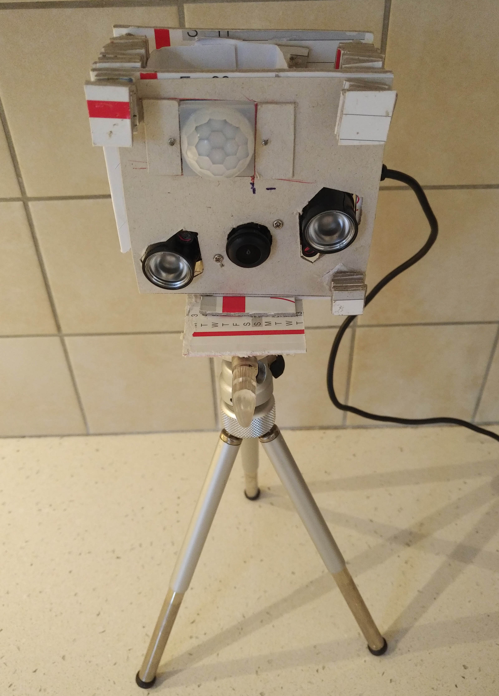
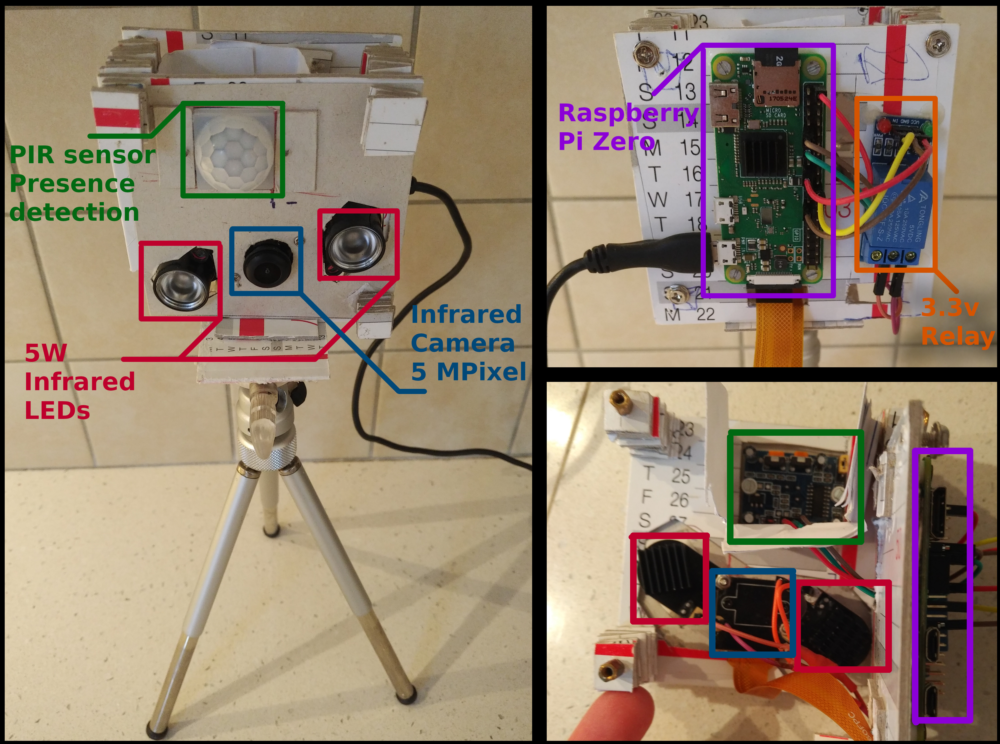
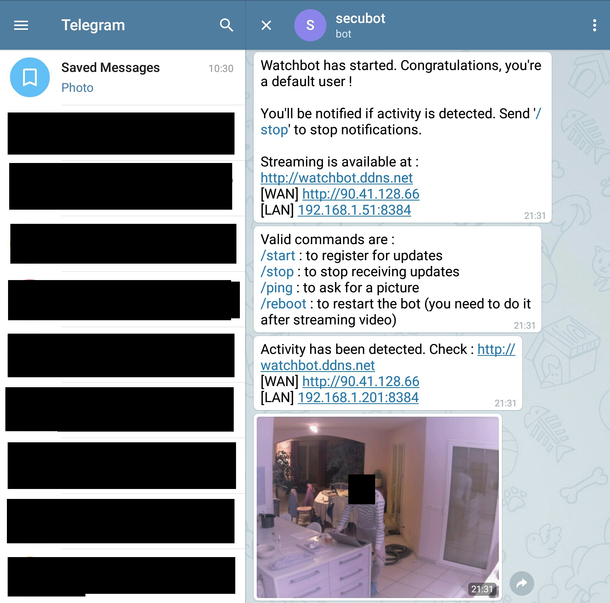

  

## Overview

This project implements a security camera that can communicate with its 
users via a telegram bot. Current features :
 
- Presence detection with PIR sensor

- Notification & photo sent via telegram upon presence detection

- Webserver for video streaming

  

  

This project is currently a functionning proof-of-concept. It works, but 
there is still a lot of improvements to do (see backlog below).

## Backlog

    ## TODO
    
    replace h264+http-live-player.js by HTTP live streaming or webRTC

    client-server architecture
      Client sends activity / video data
      server aggregates multiple clients
        heartbeat for failure detection
        streaming server aggregating all clients
        grafana dashboard
    
    Various uprioritized features 
        camera : centralize access for simultaneous photo + video
        don't sleep() between frames
        telegram bot
            group conversation
            send only photos with notifications
            
    proper webapp
        tabbed layout
            https://codepen.io/dapacreative/pen/PqXxoP
            https://speckyboy.com/10-simple-code-snippets-creating-beautiful-tabs/
        quality presets 
            settings tab with multiple presets
            code : client now sends the wanted quality preset
            preset detection from user agent
    
    QoL / bugs / stability / code improvement
        creation/destruction of the camerawrapper should be implemented with and incrementing/decrementing lock
        Thread / Coroutine issue == debug the simplified architecture (streamsplitter as the output of picamera) with stackoverflow
        that unknown bug : https://sourceware.org/bugzilla/show_bug.cgi?id=19329
        Proper exception management w/ telegram send timeouts (photo)

    ## TESTING

    PirManager
       	implement software activation pattern

    QoL / bugs / stability / code improvement
        add graceful exit + ping client
            fix "STOPSTREAM not received when stream running" bug 
            try a proper coroutine architecture for stream_process
            check for exceptions, exit properly
                (camera callback = enqueue, coroutine = await dequeue)

    ## DONE

    general pi powersaving
        https://www.jeffgeerling.com/blogs/jeff-geerling/raspberry-pi-zero-conserve-energy
            HDMI - /opt/vc/bin/tvservice -o (-p to enable again)
            LED - echo 'none' > /sys/class/leds/led0/trigger; echo '1' > /sys/class/leds/led0/brightness;
             +--> /root/autostart.sh
        Bluetooth --> /boot/config.txt
        https://github.com/masneyb/weather-station/blob/master/bin/power-savings
            powertop 
                /usr/sbin/powertop --auto-tune
            kernel modules
                rmmod snd_bcm2835 snd_pcm snd_timer snd || true
            allow CPU frequency range to go lower than default 700MHz
                --> /boot/config.txt

    fixed ip

    bugs 
        Telegram : sending photos > 550ko timeout, regardless of the timeout parameter
            https://urllib3.readthedocs.io/en/latest/user-guide.html#using-timeouts
            modified (~L270) /usr/lib/python3.7/site-packages/telegram/utils/request.py 
                ^ This is the fix : set connect timeout to same timeout as receive timeout
            modified  (~L70) /usr/lib/python3.7/site-packages/telegram/bot.py

    Send photo on movement detected + send photo on ping

    port git-h264-live-player to pure python       
        Split nodejs code into httpserver and websocketserver     
        convert http server to python / tornado
        convert websocket / streaming server to python
            rewrite stream-split
            raspivid stream version
            pure python / picamera stream version
            
    register / ping over telegram bot

    "h264 streaming over http/websocket" Proof of concept from borrowed nodejs code

    Basic photo and video

    PIR Sensor 
        multiple callback
        motion detection

    3-setup-user.sh

    2-setup-system.sh

    1-mksdcard.sh
        nm-profiles
        sh+hostname setup
        wifi-autoconnect
        arch linux extract script
